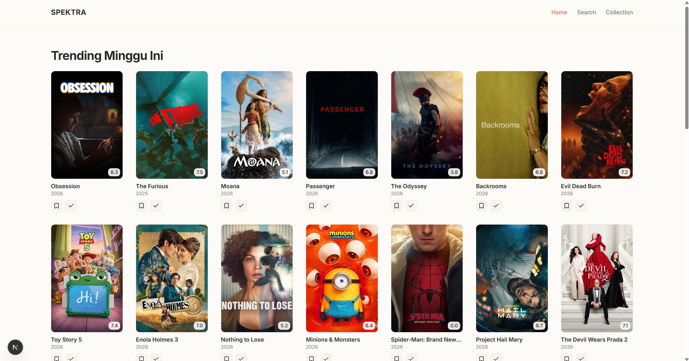
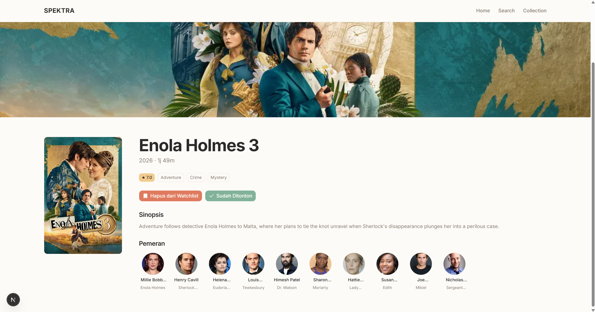
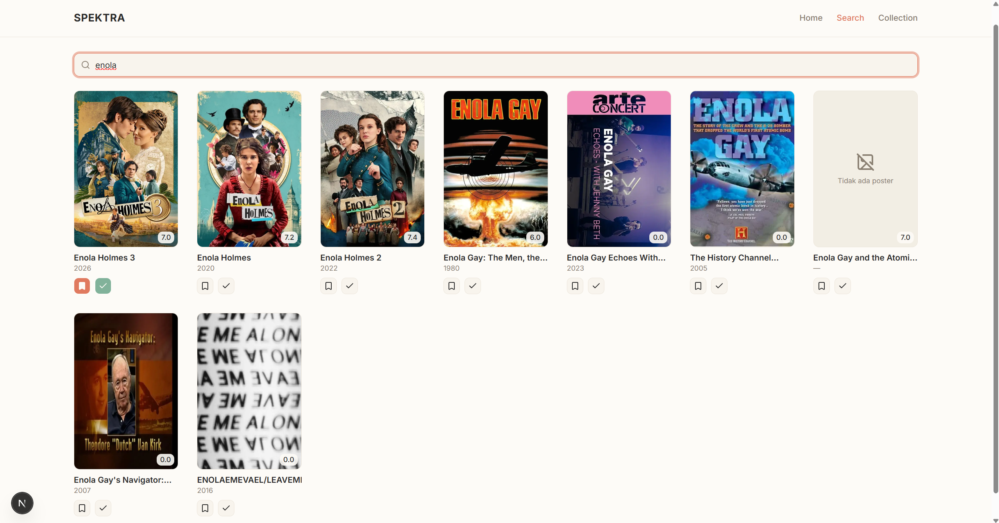
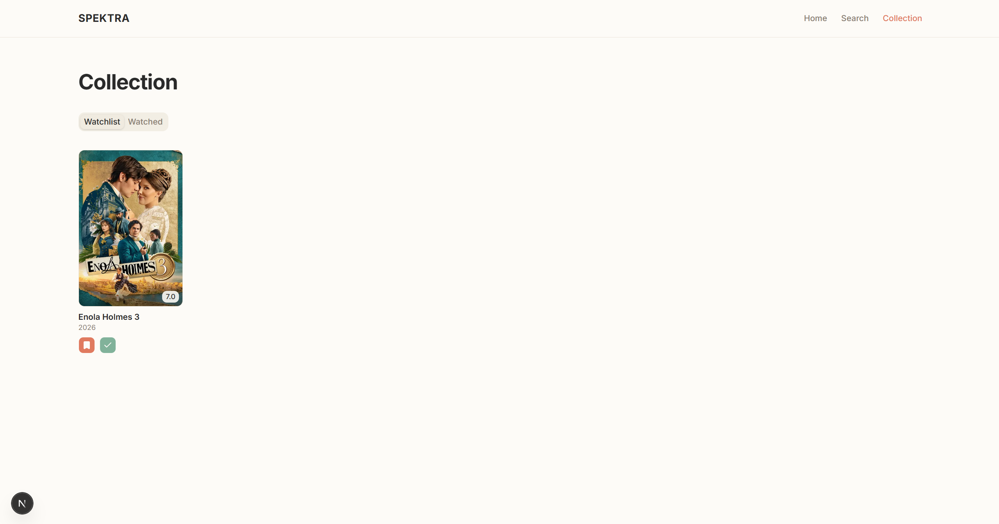

# Spektra

Aplikasi web untuk melacak film: cari film yang menarik, simpan ke daftar tontonan, lalu tandai kalau sudah selesai ditonton. Datanya diambil dari TMDB, koleksinya disimpan di perangkat sendiri, dan tidak perlu bikin akun.

Dibangun sebagai Tugas Besar Frontend Web Development, CCI (Central Computer Improvement) Telkom University.

## Tampilan

| Home | Detail film |
|:---:|:---:|
|  |  |
| **Pencarian** | **Koleksi** |
|  |  |

## Latar Belakang

Orang yang suka nonton film biasanya punya masalah yang sama, yaitu daftar tontonan tersebar di mana-mana. Sebagian di catatan HP, sebagian di chat sama teman, sisanya cuma diingat-ingat. Akhirnya lupa mau nonton apa, atau malah nonton ulang film yang sebenarnya sudah pernah ditonton.

Spektra menyelesaikan itu dengan cara paling sederhana, satu tempat untuk menyimpan apa yang mau ditonton dan apa yang sudah selesai. Tidak ada login, tidak ada onboarding. Buka, cari, lalu tandai.

## Fitur

**Menjelajah film**
Halaman utama menampilkan film yang sedang trending minggu ini dan film populer, dalam bentuk grid poster yang menyesuaikan lebar layar (dua kolom di HP sampai tujuh kolom di monitor lebar).

**Pencarian**
Ketik judul film dan hasilnya langsung muncul. Pencarian memakai debounce 400ms supaya tidak membanjiri API dengan request setiap kali satu huruf diketik. Halaman ini punya empat kondisi berbeda: belum mengetik, sedang memuat, ada hasil, dan tidak ditemukan.

**Detail film**
Backdrop besar di bagian atas, lalu poster berdampingan dengan informasi film: judul, tahun, durasi, rating, genre, sinopsis, dan sepuluh pemeran utama. Di layar kecil, semuanya menumpuk vertikal.

**Menandai tontonan**
Setiap film bisa ditandai "Mau Ditonton" atau "Sudah Ditonton", baik langsung dari kartu di grid maupun dari halaman detailnya. Tombolnya berubah sesuai status: kalau film sudah ada di daftar, tombol yang sama berfungsi untuk mengeluarkannya.

**Koleksi**
Dua tab berisi film yang sudah ditandai. Data bertahan meski browser ditutup, karena disimpan di localStorage.

## Teknologi

| Bagian | Pilihan |
|--------|---------|
| Framework | Next.js 16 (App Router) |
| Bahasa | TypeScript |
| Styling | Tailwind CSS v4 |
| Komponen UI | shadcn/ui |
| Sumber data | TMDB API |
| Penyimpanan | localStorage |

Tidak ada backend dan tidak ada database. Semua data film diambil langsung dari TMDB, sementara koleksi user cukup disimpan di browser. Untuk kebutuhan aplikasi seperti ini, menambah backend justru menambah kerumitan tanpa memberi manfaat nyata.

## Struktur Proyek

```
app/
  layout.tsx              navbar dan pembungkus global
  page.tsx                Home
  search/page.tsx         Pencarian
  collection/page.tsx     Koleksi
  movie/[id]/page.tsx     Detail film (dynamic route)

components/
  navbar.tsx              navigasi atas, jadi drawer di mobile
  movie-card.tsx          kartu poster berisi rating dan tombol tandai
  movie-grid.tsx          grid responsif
  movie-section.tsx       pembungkus seksi di Home
  movie-detail-view.tsx   tampilan halaman detail
  track-buttons.tsx       tombol watchlist dan watched
  states/                 skeleton, error, empty
  ui/                     komponen shadcn

hooks/
  use-movies.ts           ambil daftar film
  use-movie-detail.ts     ambil detail dan pemeran
  use-movie-search.ts     pencarian dengan debounce
  use-debounced-value.ts  debounce generik
  use-collection.ts       baca dan ubah koleksi

lib/
  tmdb.ts                 pembungkus fetch ke TMDB
  storage.ts              baca dan tulis localStorage

types/
  movie.ts                tipe data film dan koleksi
```

## Catatan Teknis

### Membaca localStorage tanpa hydration mismatch

Next.js merender halaman lebih dulu di server, sementara localStorage cuma ada di browser. Kalau status watchlist dibaca langsung saat render pertama, hasil render server dan client akan berbeda, dan React akan protes.

Solusi yang umum dipakai adalah menunda pembacaan sampai `useEffect` jalan, tapi itu terasa seperti menambal gejala. Di sini koleksi dibaca lewat `useSyncExternalStore`, API React yang memang dirancang untuk kasus seperti ini. Ia menerima dua sumber: snapshot untuk server (dikembalikan sebagai array kosong) dan snapshot untuk client (isi localStorage yang sebenarnya). React yang mengatur kapan beralih dari yang satu ke yang lain, sehingga tidak ada mismatch.

### Sinkronisasi antar komponen tanpa state global

Satu film bisa muncul di beberapa tempat sekaligus: kartu di Home, tombol di halaman detail, dan grid di Koleksi. Kalau statusnya diubah dari satu tempat, yang lain harus ikut berubah.

Menaruh koleksi di state global (Context atau Zustand) sebenarnya bisa, tapi berlebihan untuk kebutuhan sekecil ini. Sebagai gantinya, setiap penulisan ke localStorage men-dispatch custom event. Semua komponen yang membaca key yang sama ikut mendengarkan event itu lewat `useSyncExternalStore`, jadi mereka otomatis ter-update. localStorage-nya sendiri yang berperan sebagai sumber kebenaran.

### Referensi array yang stabil

`useSyncExternalStore` membandingkan hasil snapshot antar render. Kalau `JSON.parse` dipanggil setiap kali, hasilnya adalah array baru dengan referensi berbeda, walaupun isinya sama persis. React akan mengira datanya berubah, lalu render ulang, lalu parse lagi, dan seterusnya sampai infinite loop.

Karena itu hasil parse di-cache berdasarkan raw string localStorage-nya. Selama string-nya tidak berubah, array yang dikembalikan adalah objek yang sama.

### Tombol di dalam kartu yang bisa diklik

Kartu film adalah sebuah link menuju halaman detail, tapi di dalamnya ada tombol untuk menandai film. Menaruh `<button>` di dalam `<a>` menghasilkan HTML yang tidak valid dan perilaku klik yang membingungkan.

Solusinya, `Link` hanya membungkus area poster dan judul. Tombol tandai diletakkan sebagai elemen bersebelahan, bukan di dalamnya.

## Desain

Kebanyakan aplikasi film memakai tema gelap. Spektra sengaja mengambil arah sebaliknya: latar terang dengan palet hangat. Selain membuatnya terasa berbeda, poster film justru tetap menonjol di atas latar krem yang lembut.

Aturan yang dipegang selama membangun tampilannya:

- Warna solid saja, tidak ada gradient di elemen mana pun
- Tidak ada efek glow, neon, atau blur transparan
- Bayangan seperlunya dan halus, bukan bayangan tebal berwarna
- Ruang kosong yang lega dan hirarki teks yang tegas lebih diutamakan daripada dekorasi

| Peran | Warna |
|-------|-------|
| Latar | `#FDFBF7` |
| Utama | `#E07A5F` |
| Sekunder | `#F2CC8F` |
| Sudah ditonton | `#81B29A` |
| Teks | `#2A2A2A` |
| Teks sekunder | `#8A8072` |
| Garis | `#ECE5DA` |

Tipografi memakai Inter, dimuat lewat `next/font` supaya tidak ada layout shift saat font selesai dimuat.

## Menjalankan di Lokal

Butuh Node.js 18 ke atas dan API key TMDB. Key-nya gratis, tinggal daftar di [themoviedb.org](https://www.themoviedb.org/settings/api).

Clone dan pasang dependency:

```bash
git clone https://github.com/ramirezzServer/TUBES_CCI.git
cd TUBES_CCI
npm install
```

Buat file `.env.local` di root proyek:

```
NEXT_PUBLIC_TMDB_API_KEY=isi_dengan_api_key_kamu
```

Jalankan:

```bash
npm run dev
```

Lalu buka [http://localhost:3000](http://localhost:3000).

## Atribusi

Data film disediakan oleh [TMDB](https://www.themoviedb.org/). Proyek ini memakai TMDB API, tetapi tidak didukung maupun disertifikasi oleh TMDB.